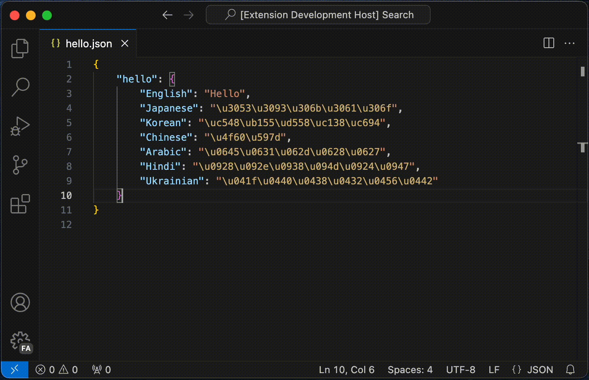

# JSON Unescaped Unicode

[](https://marketplace.visualstudio.com/items?itemName=sunaoka.json-unescaped-unicode)
[](https://github.com/sunaoka/json-unescaped-unicode/actions/workflows/test.yml)
[](https://codecov.io/gh/sunaoka/json-unescaped-unicode)

----

Unescape Unicode Escape Sequences in JSON.

## Features



## From

```json
{
    "hello": {
        "English": "Hello",
        "Japanese": "\u3053\u3093\u306b\u3061\u306f",
        "Korean": "\uc548\ub155\ud558\uc138\uc694",
        "Chinese": "\u4f60\u597d",
        "Arabic": "\u0645\u0631\u062d\u0628\u0627",
        "Hindi": "\u0928\u092e\u0938\u094d\u0924\u0947",
        "Ukrainian": "\u041f\u0440\u0438\u0432\u0456\u0442"
    }
}
```

## To

```json
{
    "hello": {
        "English": "Hello",
        "Japanese": "こんにちは",
        "Korean": "안녕하세요",
        "Chinese": "你好",
        "Arabic": "مرحبا",
        "Hindi": "नमस्ते",
        "Ukrainian": "Привіт"
    }
}
```
